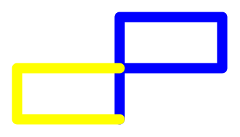

# Gallery of Interesting Shapes

#### *The single line* 
*The single line* is just an example from Prof. Bergmann to get us started. Note: Check the [gallery URL](http://UW-GEOG458-Win2018.github.io/shapes.html) after you save it to make sure it works.

#### Our pictures including the pentagon and n-sided figure
#### Work by Quezan & Nikhil

#### Work by Frank & Jonathan

#### Shapes by Sheena & Marvin!

#### Shapes by Yulong, Kuo, & Sara

#### Shapes by Travis & Martin!

### A purple star by Kim Vo & Alexandra Campanilla

